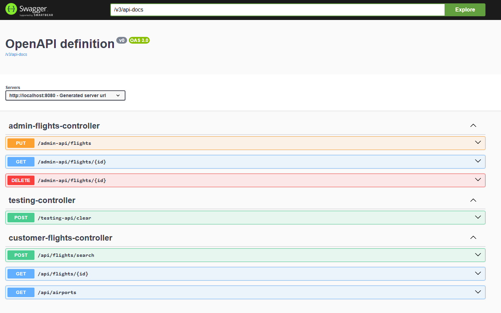

# FlightPlannerApp

## Overview

FlightPlannerApp is a web application that provides flight management functionalities. It allows administrators to add,
view, and delete flights, while customers can search for flights and view available airports. The application supports
two profiles: in-memory and database, making it flexible for different environments.

## Features

- **Admin API**
    - Add new flights
    - View flight details by ID
    - Delete flights by ID
- **Customer API**
    - Search for available flights
    - View airports by search term
    - View flight details by ID
- **Testing API**
    - Clear all flight data

## Technologies Used

- Spring Boot
- Spring Security
- JPA/Hibernate
- H2 Database
- Liquibase
- Jakarta Validation
- SpringDoc OpenApi (Swagger)

## Getting Started

### Prerequisites

- Java 21
- Gradle 7.0+
- Git

### Installation

1. Clone the repository:

```shell
git clone https://github.com/Zelchs/flight-planner.git
cd flight-planner
```

2. Build the project:

```shell
./gradlew clean build
```

### Running the Application

#### Using In-Memory Storage

1. Set the active profile to `in-memory`:

```shell
export SPRING_PROFILES_ACTIVE=in-memory
```

2. Run the application

```shell
./gradlew bootRun
```

#### Using Database Storage

1. Set the active profile to `db`:

```shell
export SPRING_PROFILES_ACTIVE=db
```

2. Run the application:

```shell
./gradlew bootRun
```

### Accessing the Application

* Admin API: http://localhost:8080/admin-api/flights (requires authorization)
* Customer API: http://localhost:8080/api
* H2 Console: http://localhost:8080/h2-console (Database URL: jdbc:h2:mem:flightplannerdb, User: sa, Password: password)

## API Endpoints

### Admin API

Authorization Required: To access the Admin API endpoints, you need to authorize using the credentials specified in
the application.properties file.

* GET /admin-api/flights/{id}
    * Get flight details by ID.
* PUT /admin-api/flights
    * Add a new flight.
* DELETE /admin-api/flights/{id}
    * Delete a flight by ID.

### Customer API

* GET /api/airports
    * Search for airports.
* GET /api/flights/{id}
    * Get flight details by ID.
* POST /api/flights/search
    * Search for flights.

### Testing API

* POST /testing-api/clear
    * Clear all flight data.

## Configuration

### application.properties

```properties
spring.application.name=FlightPlannerApp
spring.security.user.name=codelex-admin
spring.security.user.password=Password123
spring.profiles.active=db
spring.h2.console.enabled=true
spring.h2.console.path=/h2-console
spring.datasource.url=jdbc:h2:mem:flightplannerdb
spring.datasource.driverClassName=org.h2.Driver
spring.datasource.username=sa
spring.datasource.password=password
spring.jpa.database-platform=org.hibernate.dialect.H2Dialect
logging.level.liquibase=INFO
spring.liquibase.change-log=classpath:/db/changelog/changelog-master.xml
```

### Security

The application uses basic authentication. The default username and password are specified in the application.properties
file. Use these credentials to access the Admin API:

* Username: codelex-admin
* Password: Password123

## Swagger UI

You can access the Swagger UI to interact with the APIs and view the documentation:

* URL: http://localhost:8080/swagger-ui.html

### Swagger UI Screenshot


